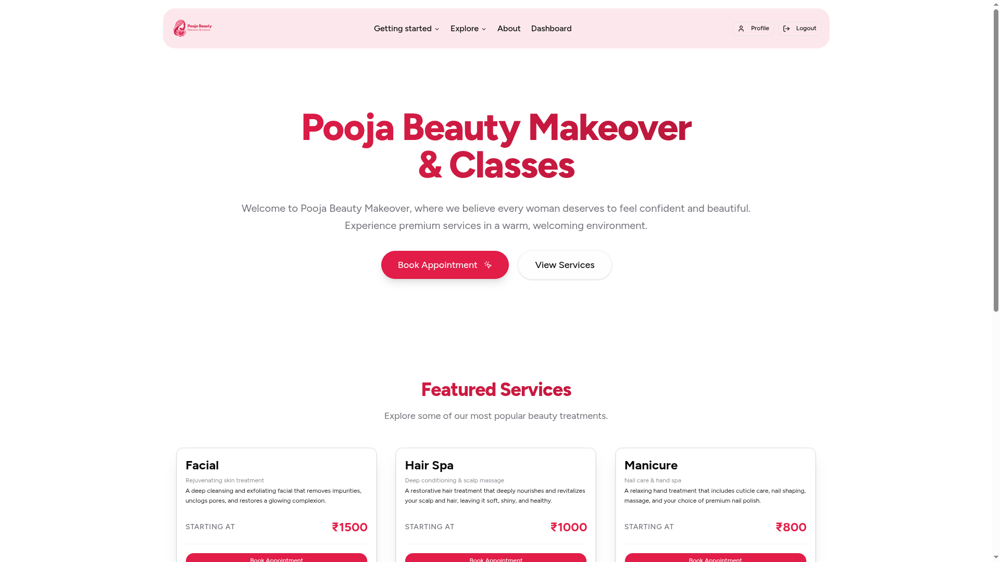
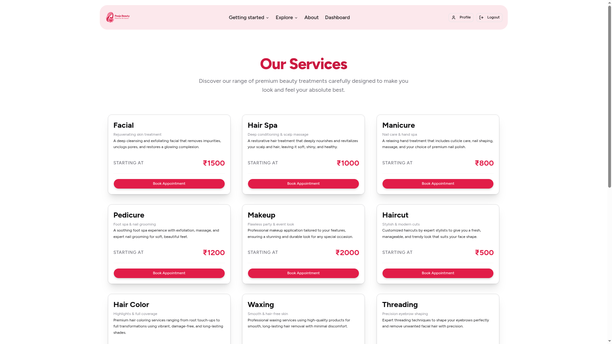
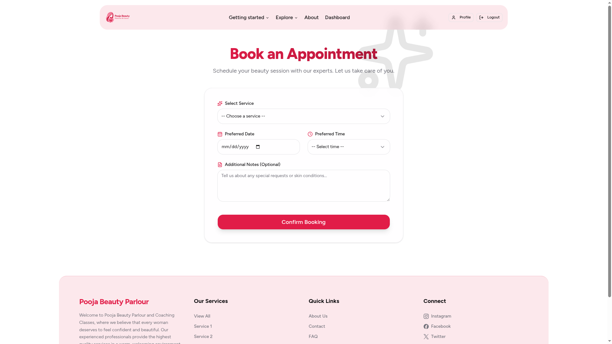
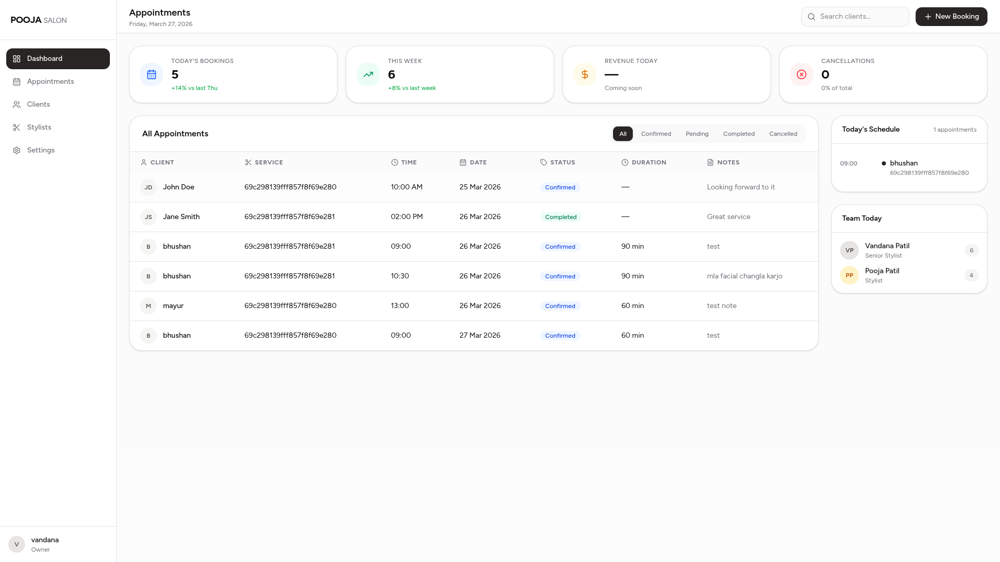

# Beauty Salon

<div align="center">
  
  
  <br>
  
  
</div>

A full-stack salon appointment booking system built with the MERN stack (MongoDB, Express, React, Node.js). This application enables customers to browse available services and book appointments, while providing salon owners with a dedicated admin portal to manage bookings.

## Recent Updates

- **Interactive Status Management**: Upgraded the Admin Dashboard appointments table with an inline "Action" column to instantly change appointment statuses (Pending, Confirmed, Completed, Cancelled). Updates are made optimistically in the UI and persisted via a new `PATCH /appointments/admin/:id/status` endpoint.
- **Improved Booking Logic**: New appointments now default to a `pending` state. The scheduling algorithm was updated to properly parse populated service data and aggressively ignore `cancelled` appointments, thereby freeing up time slots.
- **Admin Dashboard**: Built a fully functional `AdminDashboard.tsx` page at `/admin/dashboard` showing live appointment stats (booked / completed / cancelled counts) and a full appointments table with customer name, phone, date, time, color-coded status badge, duration, and notes. Appointments are populated server-side with user data via Mongoose `.populate()`.
- **Admin Route Guards**: Added a dedicated `src/routes/` folder containing `ProtectedRoute.tsx` (user auth) and `AdminProtectedRoute.tsx` (admin-only — redirects non-admins to home and unauthenticated users to `/login/admin`). Both exported from a barrel `index.ts`.
- **`adminAuth` Middleware**: Added server-side `adminAuth` middleware that validates the JWT cookie and enforces `role === "admin"` before granting access to admin-only endpoints.
- **Admin-only Appointments Endpoint**: Added `GET /appointments/admin/all` protected by `adminAuth`. Removed the previously unprotected `GET /appointments/all` endpoint. Results are populated with user data (excluding password).
- **Refactored Architecture**: Migrated global state management to **Redux Toolkit**. Refactored into a scalable feature-based frontend architecture structure via `src/features/` and `src/app/store.ts`.
- **My Appointments**: Users can efficiently check their self-booked reservations directly from their profile via newly integrated API endpoints.
- **Navbar Dashboard Link**: Navbar now conditionally shows a "Dashboard" link for admin users (both desktop and mobile menus).
- **Role-Based Authentication**: Separate admin and user auth flows. Admin signup/login require a `secretKey` validated against `ADMIN_SECRET_KEY` in `.env`. Users are blocked from admin routes and vice versa.
- **Admin Signup & Login Pages**: `AdminSignup.tsx` and `AdminLogin.tsx` with `secretKey` field. Backed by `adminSignupValidation` and `adminLoginValidation` middleware.
- **Auth Session Persistence**: The Redux hook initializes `initAuth()` to securely reload sessions via `/auth/user` on refresh to cleanly prevent premature `<ProtectedRoute>` redirects.
- **Appointment Booking Flow**: `Appointment.tsx` with timeslot blocking logic using `GET /appointments/date/:date` and service duration.
- **UI/UX Refinements**: Frosted glass navbar/footer, responsive forms, and React list rendering fixes.

## Project Structure

```
pooja-Beauty-Salon/
├── client/
│   └── src/
│       ├── routes/          # ProtectedRoute & AdminProtectedRoute
│       ├── pages/           # Page layouts and entry points
│       ├── app/             # Global Redux store configuration and typed hooks
│       ├── features/        # Feature-based slices (auth, services, appointments)
│       ├── api/             # Axios API functions
│       └── components/      # Shared layout and UI components
└── server/
    └── src/
        ├── controllers/     # Route handlers
        ├── middlewares/     # auth, formValidation
        ├── models/          # Mongoose schemas
        └── routes/          # Express routers
```

## Tech Stack

### Frontend (`/client`)
- **Framework**: React 19 + TypeScript + Vite
- **State Management**: Redux Toolkit + React-Redux
- **Styling**: Tailwind CSS v4
- **UI Components**: shadcn/ui & Radix UI
- **Routing**: React Router DOM (v7)
- **Icons**: Lucide React
- **HTTP**: Axios

### Backend (`/server`)
- **Runtime**: Node.js
- **Framework**: Express.js
- **Database**: MongoDB with Mongoose
- **Auth**: JWT (via cookie), bcrypt
- **Validation**: express-validator
- **Other**: CORS, cookie-parser, dotenv

## Getting Started

### Prerequisites
- Node.js (v18 or higher)
- MongoDB running locally or a MongoDB Atlas URI

### 1. Server Setup

```bash
cd server
npm install
cp env.sample .env   # then fill in your values
npm run dev
```

The backend runs on `http://localhost:8080` (or the port specified in `.env`).

#### Required `.env` Variables

| Variable | Description |
|---|---|
| `DB_URI` | MongoDB connection string |
| `PORT` | Server port (default: `8080`) |
| `JWT_SECRET` | Secret key for signing JWTs |
| `ADMIN_SECRET_KEY` | Secret passphrase required to create/login as admin |

### 2. Client Setup

```bash
cd client
npm install
npm run dev
```

The React app will be available at `http://localhost:5173`.

## Core Features

- **Customer Portal**: Browse salon services and book appointments with real-time availability checking.
- **Admin Dashboard**: Live stats and a full appointments table (customer details, date, time, status, duration, notes). Includes inline status management (Pending/Confirmed/Completed/Cancelled) which dynamically updates the database. Admin-only — protected by `AdminProtectedRoute` on the frontend and `adminAuth` middleware on the backend.
- **Role-Based Auth**: User model supports `"user"` and `"admin"` roles. Dedicated route guards (`ProtectedRoute`, `AdminProtectedRoute`) in `src/routes/` and server-side middleware enforce access per role.
- **Authentication & State**: Secure HttpOnly cookie-based JWT. Redux Toolkit slices (`authSlice`, `appointmentsSlice`) seamlessly govern scalable state tracking globally and systematically handle re-hydration on load.
- **Appointment Timeslot Blocking**: Prevents overlapping bookings based on service duration and existing appointments for a given date.
- **Responsive Design**: Mobile-friendly UI using Tailwind CSS and shadcn/ui.

## Application Routes

### Frontend Routes

| Path | Description | Protected |
|---|---|---|
| `/` | Home page | No |
| `/services` | Services listing | No |
| `/about` | About page | No |
| `/introduction` | Introduction page | No |
| `/signup` | User registration | No |
| `/login` | User login | No |
| `/signup/admin` | Admin registration (requires secret key) | No |
| `/login/admin` | Admin login (requires secret key) | No |
| `/appointments` | Appointment booking page | Yes (user) |
| `/admin/dashboard` | Admin dashboard with appointments table | Yes (admin) |
| `/profile` | User profile & dashboard | Yes (user) |

### Backend API Endpoints

#### Health
| Method | Endpoint | Description |
|---|---|---|
| `GET` | `/health` | Server health check |

#### Services
| Method | Endpoint | Description |
|---|---|---|
| `GET` | `/services` | List all salon services |

#### Appointments
| Method | Endpoint | Auth | Description |
|---|---|---|---|
| `GET` | `/appointments/date/:date` | Public | Get appointments for a specific date |
| `POST` | `/appointments/create` | User | Create a new appointment |
| `GET` | `/appointments/admin/all` | Admin | List all appointments (with user details) |
| `PATCH` | `/appointments/admin/:id/status` | Admin | Update appointment status |

#### Auth
| Method | Endpoint | Description |
|---|---|---|
| `POST` | `/auth/signup` | Register a new user (role: `user`) |
| `POST` | `/auth/signup/admin` | Register a new admin — requires `secretKey` |
| `POST` | `/auth/login` | Login as a regular user |
| `POST` | `/auth/login/admin` | Login as admin — requires `secretKey` |
| `GET` | `/auth/user` | Get currently authenticated user (JWT cookie) |
| `POST` | `/auth/logout` | Logout and clear JWT cookie |

## Scripts

**Client:**
```bash
npm run dev      # Start Vite dev server
npm run build    # Build for production
npm run lint     # Run ESLint
```

**Server:**
```bash
npm run dev      # Start backend with nodemon
```
